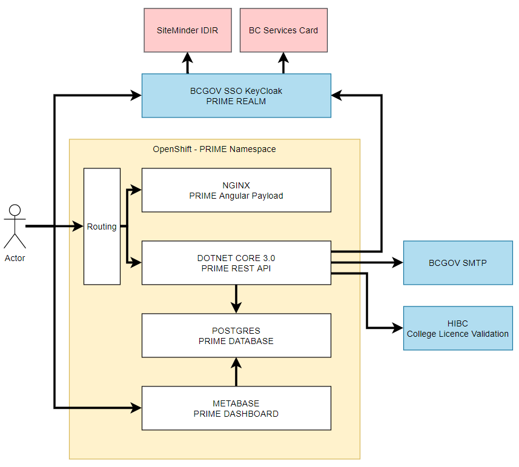

# Optimize Prime Architecture

## Azure

Microsoft Azure was utilized to host an Ubuntu Linux Virtual Machine running docker as a daemon utility. Azure allowed us to quickly get a production environment to simply host docker and our production application within it.

## Docker

Containers allow us to simplify our deployment of development artifacts.

## primeweb

The primeweb docker container hosts an Angular built payload hosted by NGINX. 

NGINX serves two purposes:

1. It is the web server host to serve the angular payload to the client web browser
2. It performs a reverse proxy (proxy_pass) to the primeapi container for all requests under the /api/ directory. This simplifies the hosting and removes any need for CORS exceptions.   

Angular is our dynamic web page application framework that our frontend is developed in.

## primeapi

The primapi container runs our dot net core 2.2 C# application. It uses the webapi template with controllers inheriting ControllerBase. The application utilizes Entity Framework as an ORM to the Postgresql database.

## primedb

The primedb container runs a Postgresql 11.4 database. This database contains a single table called application migrated via Entity Framework.