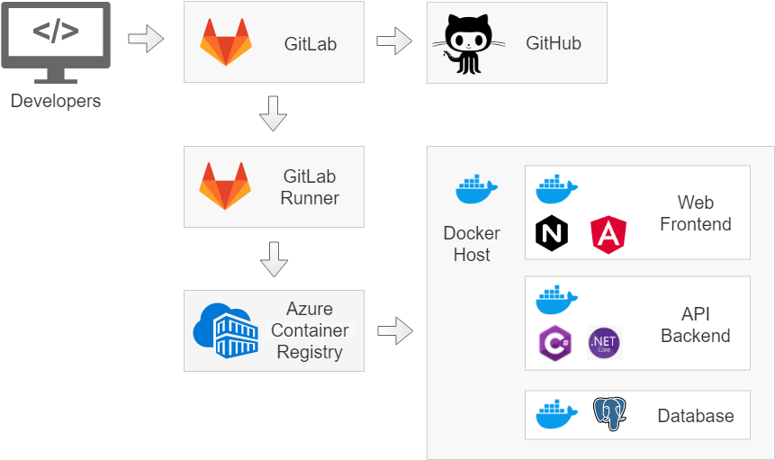

# Overview
This is to outline and explain the technologies, methodology and logic behind the project's pipeline selection and design.


## Workflow
Developer > GitLab > GitLab CI/CD > Azure Docker Repository > Azure VM > Docker Containers > Applications

## Code Repository
We chose to use GitLab as our repository for a few reasons:
* Free, which reduces or eliminates approval processes for many organizations
* Familiar technology, leveraging existing, popular Git
* Integrated, vendor-neutral CI/CD pipeline which can be directly integrated in codebase

## CI/CD Pipeline
As mentioned before, we selected GitLab CI/CD to handle the code. 
* Having this right next to the code eliminated the need for extra overhead with another deployment mechanism like Jenkins
* Simple YAML configuration that runs container in a container that allows for public images
* Run remote docker update from the CI/CD pipeline to all hosts

Azure Container Registry was our choice for the Docker image repo because it was in the same sphere as the application hosting.

Here's an outline of what the CI/CD YAML:
```
# Pull a working docker-compose image
image: tmaier/docker-compose:latest

# Start the docker service
services:
  - docker:dind

# Ensure docker runs first
before_script:
  - docker info
  - docker-compose --version

# Set some variables
# variables:
#  DOCKER_HOST: "primeswu.azurecr.io:80"
#  DOCKER_REPO_USER: "PrimeSWU"
#  DOCKER_REPO_PASS: "POKaaZfvf8AhsgQNmUvjJLj+XbZQoIQJ"
#  IMAGE_TAG: "optimize-prime"

build image:
  stage: build
  script:
    - docker-compose build
    - docker login https://primeswu.azurecr.io:443
    - docker tag optimizeprime_dotnet-webapi primeswu.azurecr.io:443/optimizeprime_dotnet-webapi:latest
    - docker push primeswu.azurecr.io:443/optimize-prime:latest
    - docker tag optimizeprime_nginx-angular primeswu.azurecr.io:443/optimizeprime_nginx-angular:latest
    - docker push primeswu.azurecr.io:443/optimizeprime_nginx-angular:latest
    - docker tag postgres:11.4 primeswu.azurecr.io:443/optimizeprime_postgres:latest
    - docker push primeswu.azurecr.io:443/optimizeprime_postgres:latest
    - export DOCKER_HOST=40.122.108.127:2375
    - docker-compose up
```
## Application Hosting
Because it wasn't a coding requirement to have all technology in containers _and_ because databases should persist, we chose to use an Azure VM to host the Docker containers.  This simplified our hosting topography and gave us more control over the hosting environment.
