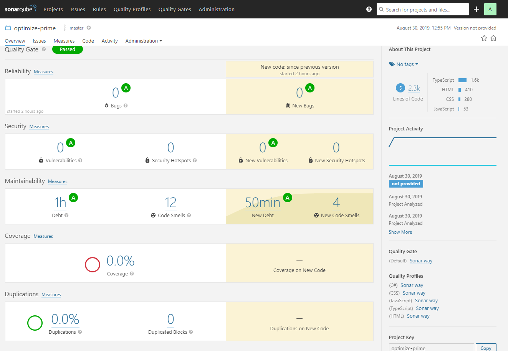

# Test Plan and Quality Review

# Test Cases and Results

[Link to Test Cases and Results](documentation/PRIME Test Cases and Results.xlsx)

# Code Review by SonarQube



# Unit Testing

Unit tests are contained in their own project under (prime-dotnet-webapi-tests). Unit tests are developed using the Xunit and Moq frameworks.

To run the tests:
```dotnet test```


